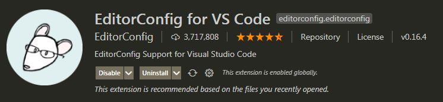
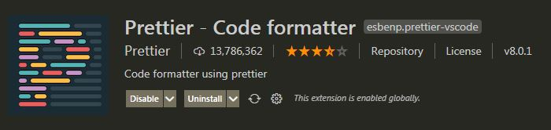
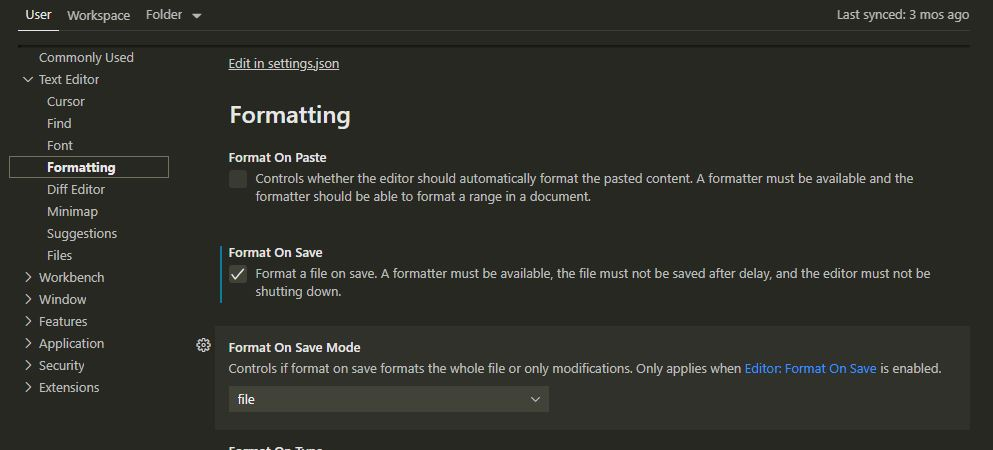
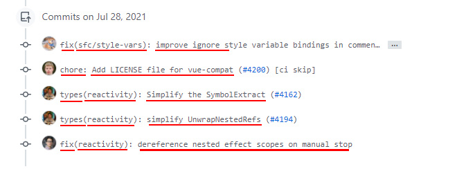

<h1 align="center">Linting</h1>

`BEFENIT`

- Solve the problem of poor readability and poor maintainability caused by irregular code between teams.
- Solve the problem of inconsistent coding standards caused by different devs of team members.
- Find code style problems in advance, give corresponding specifications prompts, and fix them in time.
- Reduce the repeated modification process in the code review process and save time.
- Automatic formatting, unified coding style, say goodbye to dirty and messy code.

| Library                      | Befenit                                                                                                          |
| ---------------------------- | :--------------------------------------------------------------------------------------------------------------- |
| 1. EditorConfig              | Sync all idle between developer to follow 1 convention                                                           |
| 2. Prettier + ESLint         | Control convention of code by following the rule (Airb2b,..), ESlint check syntax/un-use code ES (Javascript ES) |
| 3. Husky & lint staged       | Before your commit, Husky & lint taged will pre-check (run lint) and throw error if code not follow ESlint       |
| 4. Commitizen (& commitlint) | When commit text to git, committizen make your commit follow pattern (feat, fix, feature,...)                    |

### EditorConfig

- http://editorconfig.org
- Sync convention between idle now is simple by using editorconfig
- Go to `VisualStudioCode` -> `Extendsion` -> `editorconfig`

1. Create file `.editorconfig` at root directory

```
# Editor configuration, see http://editorconfig.org

# top-most EditorConfig file
root = true

[*] # All files was applied
charset = utf-8
indent_style = tab # Indentation style（tab | space）
indent_size = 2
end_of_line = lf # Control line break type(lf | cr | crlf)
trim_trailing_whitespace = true # Remove any blank characters at the beginning of the line
insert_final_newline = true # Always insert a new line at the end of the file

[*.md] # *.md
max_line_length = off
trim_trailing_whitespace = false
```

2. Install plugin to cover in idle `VisualStudioCode` -> `Extension`

<br/>

### Prettier

- https://prettier.io/
- Prettier is a powerful code formatting tool. Basically, it can handle all file formats that can be used in the front end. It is the most popular code formatting tool at the moment.

1. Install

> npm i prettier -D
> npm install --save-dev eslint-plugin-prettier

2. Create profile convention for prettier

- Prettier supports file type JSON/JSON5 | JS | TS | YML/YAML | TOML (https://prettier.io/docs/en/configuration.html)
- Normally, file `prettier.config.js or .prettierrc.js` was placed in root directory

```
module.exports = {
  "useTabs": false,
  "tabWidth": 2,
  "printWidth": 88,
  "singleQuote": true,
  "trailingComma": "none",
  "bracketSpacing": true,
  "semi": false,
  "vueIndentScriptAndStyle": true
}
```

3. Run to check

   > npx prettier --write .

4. Install plugin to cover in idle `VisualStudioCode` -> `Extension`

<br/>

5. Set default `prettier` when save file

<br/>

### ESLint

- https://eslint.org/
- ESLint is a tool for finding and reporting problems in the code, and supports automatic repair of some problems

1. Install

> npm i eslint -D

> npx eslint --init

> Select: To check syntax, find problems, and enforce code style

> Select: JavaScript modules (import/export)

> Select: Vue.js

> Select: Yes

> Select: Browser

> Select: Use a popular style guide

> Select: Airbnb: https://github.com/airbnb/

> Select: JavaScript

> Select: Yes

- `What if` all process not working auto, please refer to run command:

> npm i @typescript-eslint/eslint-plugin @typescript-eslint/parser eslint-config-airbnb-base eslint-plugin-import eslint-plugin-vue -D

2. Open file `.eslintrc.js` and check

```
module.exports = {
  env: {
    browser: true,
    es2021: true,
    node: true
  },
  extends: ['plugin:vue/essential', 'airbnb-base'],
  parserOptions: {
    ecmaVersion: 12,
    parser: '@typescript-eslint/parser',
    sourceType: 'module'
  },
  plugins: ['vue', '@typescript-eslint'],
  rules: {}
}
```

### Combine ESLint + Prettier

- Some time, the rule of `ESLint` can conflict with `Prettier`:

> npm i eslint-plugin-prettier eslint-config-prettier -D

- Config file `.eslintrc.js`

```
module.exports = {
  ...
  extends: [
    'plugin:vue/essential',
    'airbnb-base',
    'plugin:prettier/recommended' // add prettier plugin
  ],
  ...
}
```

> npm run lint-fix

### Husky & Lint staged

`Lint staged`

- When you want to lint just single file (but command `npm run lint` will run all files => unnecessary, wasting time)
- `Lint staged` will help you run a single file or a cup of files => just add file want to lint to `staged`

`Husky`

- Git Hook tool, which can be set to trigger our commands at lifecycle(various stages) of git (pre-commit, commit-msg, pre-push, etc.)
-

1. Install

> npm install --save-dev lint-staged

Add config to `package.json`

```
"lint-staged": {
	"*.{vue,js,ts}": "eslint --fix"
}
```

> npm install --save-dev husky

After install, we need to initial folder `Husky`:

> npx husky install

### Commit your code to git follow pattern (commitizen)

```
https://www.conventionalcommits.org/en/v1.0.0/
```

- What is the purpose of `commitizen`?
- work with team 10 people, it's hard to cover all type of commit (which commit is fix? new feature?) => just follow pattern when commit by commitizen

1. Install

> npm install commitizen -D -g  
> ( use "-g" to able command git cz)

- Install some `adapter` to use `commitizen`

> commitizen init cz-conventional-changelog --save-dev --save-exact

Add changelog in `package.json`:

```
  "config": {
    "commitizen": {
      "path": "cz-conventional-changelog"
    }
  }
```

> npm install --save-dev @commitlint/config-conventional @commitlint/cli

- Add file `commitlint.config.js`

```
module.exports = {
	extends: ["@commitlint/config-conventional"]
};
```

2. How to use

- `git add ...` like normal git
- instead of `git commit ...` => Now we use `git cz` => finish all QA and commit
- `git push...` like normal git

3. What is it?

-`It's the pattern of commit message` <br>

<br/>

- Normaly, commit message contain 3 container: `<header>` `<body>` `<footer>`
- Follow careful `https://www.conventionalcommits.org/en/v1.0.0/`

```
// HEADER
// The header part includes three fields type (required), scope (optional) and subject (required)
<type>(<scope>): <subject>

--------------

// BODY
[optional body]

// ex. Commit message with no body
docs: correct spelling of CHANGELOG

// ex. Commit message with body
fix: correct minor typos in code
see the issue for details
on typos fixed.

Reviewed-by: Z
Refs #133

--------------

// FOOTER
[optional footer(s)]

// ex. Commit message with description and breaking change footer
feat: allow provided config object to extend other configs

BREAKING CHANGE: `extends` key in config file is now used for extending other config files
```

```
// ex. With full header body footer
feat(reactivity): dereference nested effect scopes on manual stop

Added new reactive to system:
- ref to single variable
- reactive to object variables
- unref to remove reactive system out of the variable

BREAKING CHANGE: unhandle the beauty of code.
```
